# nd1301 supplychain 

## Contract
- address on rinkerby: 0xe43b4abA7C4054001ED795B6c6fa49733f54537e 
- [contract etherscan link](https://rinkeby.etherscan.io/address/0xe43b4abA7C4054001ED795B6c6fa49733f54537e)


## Software set up

### Versions
| software | version                |
| -------- | ---------------------- |
| Truffle  | v5.5.14 (core: 5.5.14) |
| Ganache  | v^7.1.0                |
| Solidity | 0.8.13 (solc-js)       |
| Node     | v16.13.1               |
| Web3.js  | v1.5.3                 |

*No IPFS or other libraries used*

### Design UML diagrams

#### Activity diagram
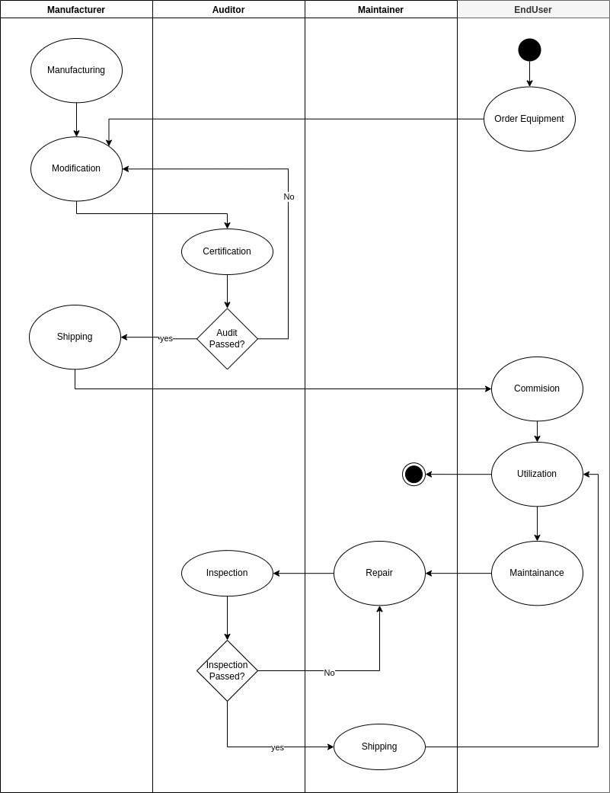

#### Sequence diagram
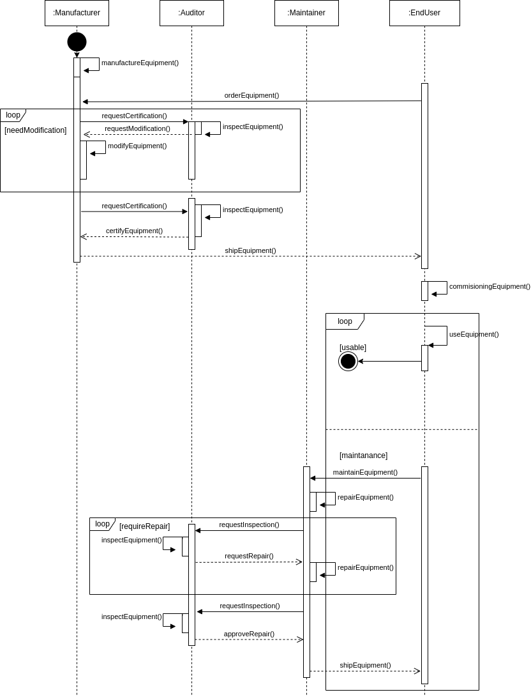

#### Statemachine diagram
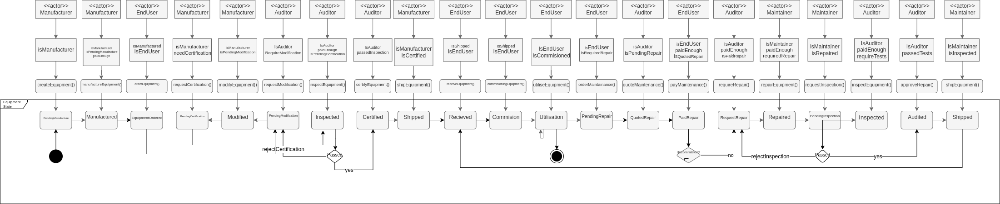

#### Classes diagram
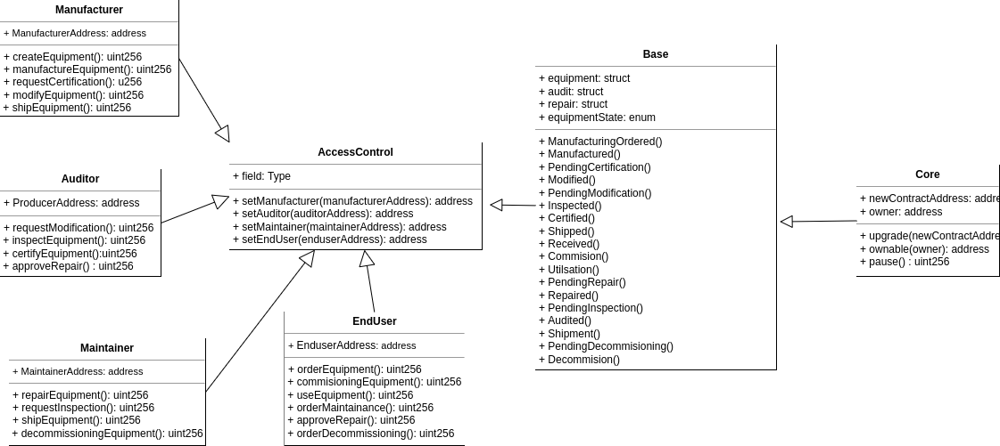

## Test result and deploylment
### Test results
The tests covers all the functions of the smart contract.
```
node ➜ /workspaces/…/nd1301/equipmentSupplychainSolidity/project-6 (master ✗) $ truffle test
Using network 'development'.

> Artifacts written to /tmp/test--93777-1XnLBdwWYbdY
> Compiled successfully using:
   - solc: 0.8.0+commit.c7dfd78e.Emscripten.clang
ganache-cli accounts used here...
Contract Owner: accounts[0]  0x1A58e72531E280634E53544Da05111D41303c09E
Manufacturer: accounts[1]  0xe75B532b11318E2b5f3424d9C82065eF422BaaB9
Auditor: accounts[2]  0xe6B1b9e1661565257A9072bC1075443284343F5F
EndUser: accounts[3]  0x465D859585c1104a38De900C775245e9861049E4
Maintainer: accounts[4]  0x5dA886443Ca7e9d9B70892D72975E685325d7A37


  Contract: SupplyChain
    ✔ Testing smart contract function createEquipment() that allows a Manufacturer to create an equipment (513ms)
    ✔ Testing smart contract function manufactureEquipment() that allows a enduser to order an equipment (222ms)
    ✔ Testing smart contract function orderEquipment() that allows a Manufacturer to order coffee (237ms)
    ✔ Testing smart contract function requestModification() that allows an auditor to request modification to the manufacturer (132ms)
    ✔ Testing smart contract function modifyEquipment() that allows a Manufacturer to modify equipment (194ms)
    ✔ Testing smart contract function requestCertification() that allows a Manufacturer to request a certification to an auditor (130ms)
    ✔ Testing smart contract function inspectEquipment() that allows an auditor to inspect an equipement (124ms)
    ✔ Testing smart contract function purchaseItem() that allows an auditor to reject Certification (112ms)
    ✔ Testing smart contract function fetchItemBufferOne() that allows an auditor to accept Certification (360ms)
    ✔ Testing smart contract function shipEquipment() that allows a Manufacturer to send a certified equipement to enduser (118ms)
    ✔ Testing smart contract function receiveEquipment() that allows a enduser to receive a certified equipement from the manufacturer (131ms)
    ✔ Testing smart contract function commissioningEquipment() that allows a enduser to commission the received certified equipement (116ms)
    ✔ Testing smart contract function utilseEquipment() that allows a enduser to use the equipement (115ms)
    ✔ Testing smart contract function orderMaintainance() that allows a enduser to order a maintenance the equipement (124ms)
    ✔ Testing smart contract function quoteMaintenace() that allows an auditor to qoute to an order of a maintenance (155ms)
    ✔ Testing smart contract function rejectMaintenanceQoute() that enduser to reject the quote of the order of a maintenance (140ms)
    ✔ Testing smart contract function payMaintenanceQuote() that enduser to accept the quote of the order of a maintenance (394ms)
    ✔ Testing smart contract function requireRepair() that allows an auditor to require to an repair of a maintenance (114ms)
    ✔ Testing smart contract function repairEquipment() that allows a manufacturer to repair for the maintenance (129ms)
    ✔ Testing smart contract function requestInspection() that allows a manufacturer to require to an inspection of a maintenance (120ms)
    ✔ Testing smart contract function rejectInspection() that allows a auditor to inspect and reject a maintenance (163ms)
    ✔ Testing smart contract function approveInspection() that allows a auditor to inspect and approves a maintenance (290ms)
    ✔ Testing smart contract function shipEquipmentMaintainer() that allows a maintainer to send back to the enduser (123ms)


  23 passing (4s)
```

### Deployment - Rinkerby

- transaction hash:   0xcba49012588ba5e55214444f3c8fd6f37c1de66b78b3e1049b9d9e9605836b7b
- contract address:0xe43b4abA7C4054001ED795B6c6fa49733f54537e 
- contract etherscan link: https://rinkeby.etherscan.io/address/0xe43b4abA7C4054001ED795B6c6fa49733f54537e

```
node ➜ /workspaces/…/nd1301/equipmentSupplychainSolidity/project-6 (master ✗) $ truffle deploy --reset --network rinkeby

Compiling your contracts...
===========================
> Everything is up to date, there is nothing to compile.


Starting migrations...
======================
> Network name:    'rinkeby'
> Network id:      4
> Block gas limit: 29999972 (0x1c9c364)


1_initial_migration.js
======================

   Replacing 'Migrations'
   ----------------------
   > transaction hash:    0x72fc00de94ae1b3b792f6b5af9dcf0d71cbe725210e9b02ed921d1c2d611cc12
   > Blocks: 1            Seconds: 9
   > contract address:    0x6600D30F0c5F4fD3F9cd068Ef7a7BFE85661B80b
   > block number:        10703385
   > block timestamp:     1652966532
   > account:             0xb9BfF2aef0Ed16Fb4f21aB4d5FE49a70aa83cF62
   > balance:             0.00982374471267592
   > gas used:            176252 (0x2b07c)
   > gas price:           1.000001015 gwei
   > value sent:          0 ETH
   > total cost:          0.00017625217889578 ETH

   Pausing for 2 confirmations...

   -------------------------------
   > confirmation number: 1 (block: 10703386)
   > confirmation number: 2 (block: 10703387)
   > Saving migration to chain.
   > Saving artifacts
   -------------------------------------
   > Total cost:     0.00017625217889578 ETH


2_deploy_contracts.js
=====================

   Replacing 'SupplyChain'
   -----------------------
   > transaction hash:    0xcba49012588ba5e55214444f3c8fd6f37c1de66b78b3e1049b9d9e9605836b7b
   > Blocks: 1            Seconds: 9
   > contract address:    0xe43b4abA7C4054001ED795B6c6fa49733f54537e
   > block number:        10703389
   > block timestamp:     1652966592
   > account:             0xb9BfF2aef0Ed16Fb4f21aB4d5FE49a70aa83cF62
   > balance:             0.006904690749839155
   > gas used:            2873340 (0x2bd7fc)
   > gas price:           1.000001015 gwei
   > value sent:          0 ETH
   > total cost:          0.0028733429164401 ETH

   Pausing for 2 confirmations...

   -------------------------------
   > confirmation number: 1 (block: 10703390)
   > confirmation number: 2 (block: 10703391)
   > Saving migration to chain.
   > Saving artifacts
   -------------------------------------
   > Total cost:     0.0028733429164401 ETH

Summary
=======
> Total deployments:   2
> Final cost:          0.00304959509533588 ETH
```

### Public rinkerby manual  test result
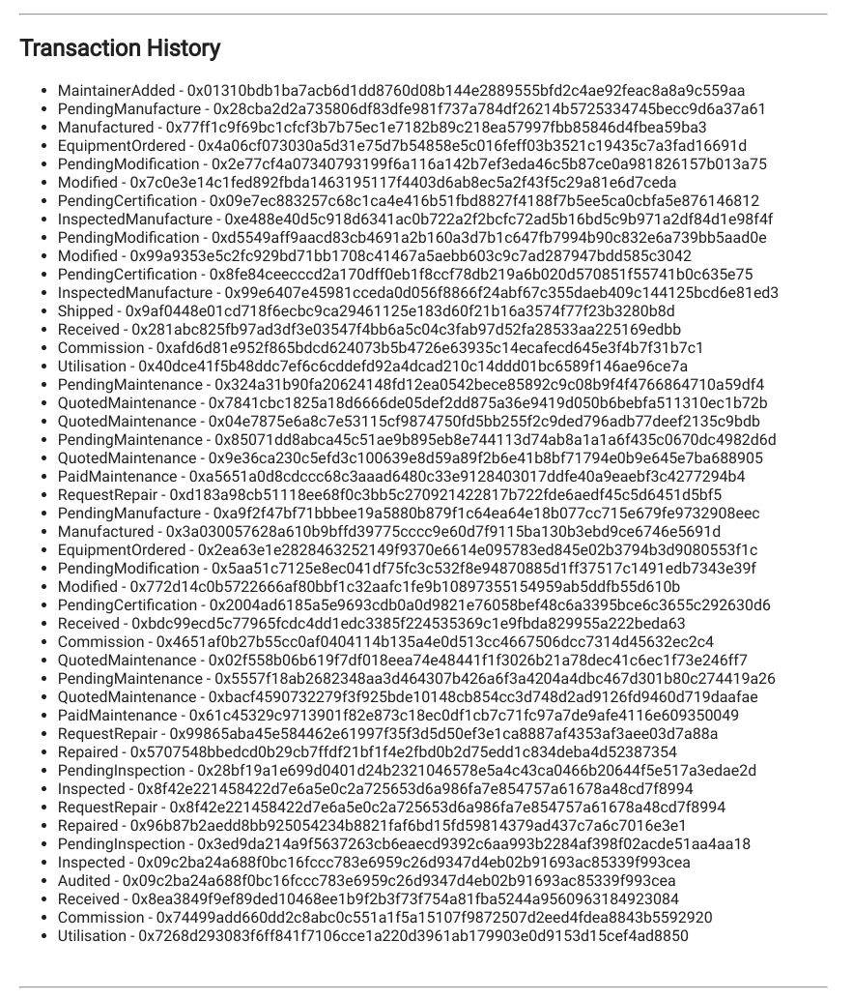

#### Test result texts

```
## Transaction History

-   MaintainerAdded - 0x01310bdb1ba7acb6d1dd8760d08b144e2889555bfd2c4ae92feac8a8a9c559aa
-   PendingManufacture - 0x28cba2d2a735806df83dfe981f737a784df26214b5725334745becc9d6a37a61
-   Manufactured - 0x77ff1c9f69bc1cfcf3b7b75ec1e7182b89c218ea57997fbb85846d4fbea59ba3
-   EquipmentOrdered - 0x4a06cf073030a5d31e75d7b54858e5c016feff03b3521c19435c7a3fad16691d
-   PendingModification - 0x2e77cf4a07340793199f6a116a142b7ef3eda46c5b87ce0a981826157b013a75
-   Modified - 0x7c0e3e14c1fed892fbda1463195117f4403d6ab8ec5a2f43f5c29a81e6d7ceda
-   PendingCertification - 0x09e7ec883257c68c1ca4e416b51fbd8827f4188f7b5ee5ca0cbfa5e876146812
-   InspectedManufacture - 0xe488e40d5c918d6341ac0b722a2f2bcfc72ad5b16bd5c9b971a2df84d1e98f4f
-   PendingModification - 0xd5549aff9aacd83cb4691a2b160a3d7b1c647fb7994b90c832e6a739bb5aad0e
-   Modified - 0x99a9353e5c2fc929bd71bb1708c41467a5aebb603c9c7ad287947bdd585c3042
-   PendingCertification - 0x8fe84ceecccd2a170dff0eb1f8ccf78db219a6b020d570851f55741b0c635e75
-   InspectedManufacture - 0x99e6407e45981cceda0d056f8866f24abf67c355daeb409c144125bcd6e81ed3
-   Shipped - 0x9af0448e01cd718f6ecbc9ca29461125e183d60f21b16a3574f77f23b3280b8d
-   Received - 0x281abc825fb97ad3df3e03547f4bb6a5c04c3fab97d52fa28533aa225169edbb
-   Commission - 0xafd6d81e952f865bdcd624073b5b4726e63935c14ecafecd645e3f4b7f31b7c1
-   Utilisation - 0x40dce41f5b48ddc7ef6c6cddefd92a4dcad210c14ddd01bc6589f146ae96ce7a
-   PendingMaintenance - 0x324a31b90fa20624148fd12ea0542bece85892c9c08b9f4f4766864710a59df4
-   QuotedMaintenance - 0x7841cbc1825a18d6666de05def2dd875a36e9419d050b6bebfa511310ec1b72b
-   QuotedMaintenance - 0x04e7875e6a8c7e53115cf9874750fd5bb255f2c9ded796adb77deef2135c9bdb
-   PendingMaintenance - 0x85071dd8abca45c51ae9b895eb8e744113d74ab8a1a1a6f435c0670dc4982d6d
-   QuotedMaintenance - 0x9e36ca230c5efd3c100639e8d59a89f2b6e41b8bf71794e0b9e645e7ba688905
-   PaidMaintenance - 0xa5651a0d8cdccc68c3aaad6480c33e9128403017ddfe40a9eaebf3c4277294b4
-   RequestRepair - 0xd183a98cb51118ee68f0c3bb5c270921422817b722fde6aedf45c5d6451d5bf5
-   PendingManufacture - 0xa9f2f47bf71bbbee19a5880b879f1c64ea64e18b077cc715e679fe9732908eec
-   Manufactured - 0x3a030057628a610b9bffd39775cccc9e60d7f9115ba130b3ebd9ce6746e5691d
-   EquipmentOrdered - 0x2ea63e1e2828463252149f9370e6614e095783ed845e02b3794b3d9080553f1c
-   PendingModification - 0x5aa51c7125e8ec041df75fc3c532f8e94870885d1ff37517c1491edb7343e39f
-   Modified - 0x772d14c0b5722666af80bbf1c32aafc1fe9b10897355154959ab5ddfb55d610b
-   PendingCertification - 0x2004ad6185a5e9693cdb0a0d9821e76058bef48c6a3395bce6c3655c292630d6
-   Received - 0xbdc99ecd5c77965fcdc4dd1edc3385f224535369c1e9fbda829955a222beda63
-   Commission - 0x4651af0b27b55cc0af0404114b135a4e0d513cc4667506dcc7314d45632ec2c4
-   QuotedMaintenance - 0x02f558b06b619f7df018eea74e48441f1f3026b21a78dec41c6ec1f73e246ff7
-   PendingMaintenance - 0x5557f18ab2682348aa3d464307b426a6f3a4204a4dbc467d301b80c274419a26
-   QuotedMaintenance - 0xbacf4590732279f3f925bde10148cb854cc3d748d2ad9126fd9460d719daafae
-   PaidMaintenance - 0x61c45329c9713901f82e873c18ec0df1cb7c71fc97a7de9afe4116e609350049
-   RequestRepair - 0x99865aba45e584462e61997f35f3d5d50ef3e1ca8887af4353af3aee03d7a88a
-   Repaired - 0x5707548bbedcd0b29cb7ffdf21bf1f4e2fbd0b2d75edd1c834deba4d52387354
-   PendingInspection - 0x28bf19a1e699d0401d24b2321046578e5a4c43ca0466b20644f5e517a3edae2d
-   Inspected - 0x8f42e221458422d7e6a5e0c2a725653d6a986fa7e854757a61678a48cd7f8994
-   RequestRepair - 0x8f42e221458422d7e6a5e0c2a725653d6a986fa7e854757a61678a48cd7f8994
-   Repaired - 0x96b87b2aedd8bb925054234b8821faf6bd15fd59814379ad437c7a6c7016e3e1
-   PendingInspection - 0x3ed9da214a9f5637263cb6eaecd9392c6aa993b2284af398f02acde51aa4aa18
-   Inspected - 0x09c2ba24a688f0bc16fccc783e6959c26d9347d4eb02b91693ac85339f993cea
-   Audited - 0x09c2ba24a688f0bc16fccc783e6959c26d9347d4eb02b91693ac85339f993cea
-   Received - 0x8ea3849f9ef89ded10468ee1b9f2b3f73f754a81fba5244a9560963184923084
-   Commission - 0x74499add660dd2c8abc0c551a1f5a15107f9872507d2eed4fdea8843b5592920
-   Utilisation - 0x7268d293083f6ff841f7106cce1a220d3961ab179903e0d9153d15cef4ad8850
```

### Frontend views
#### ROLE management
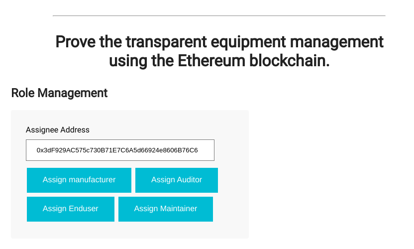

#### Product Details
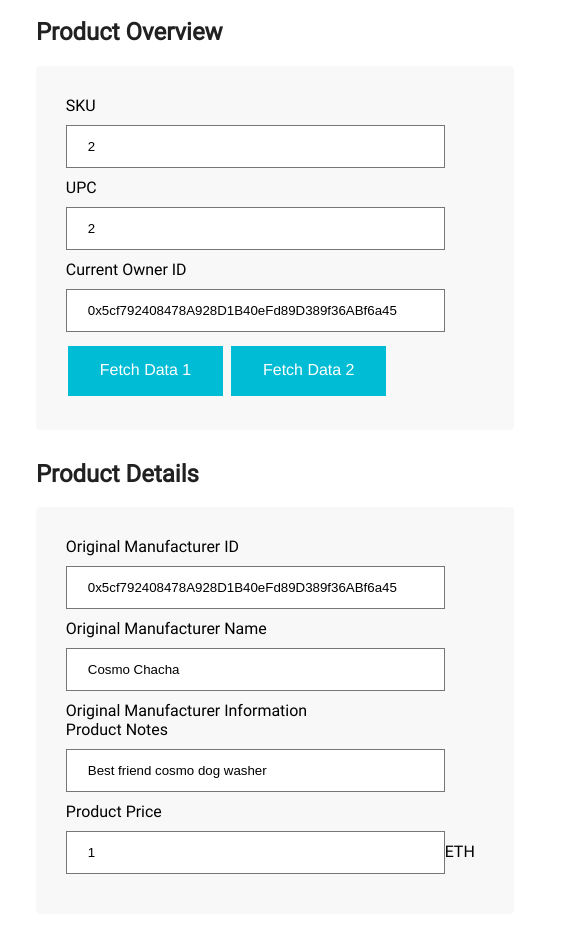

#### Manufacturer Details
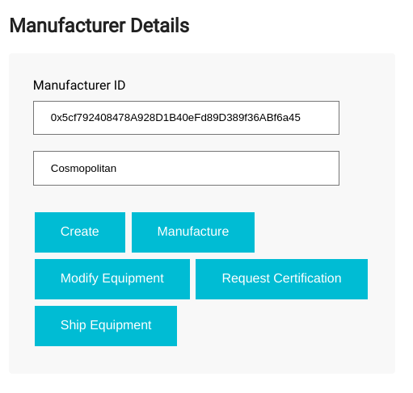

#### Inspector Details
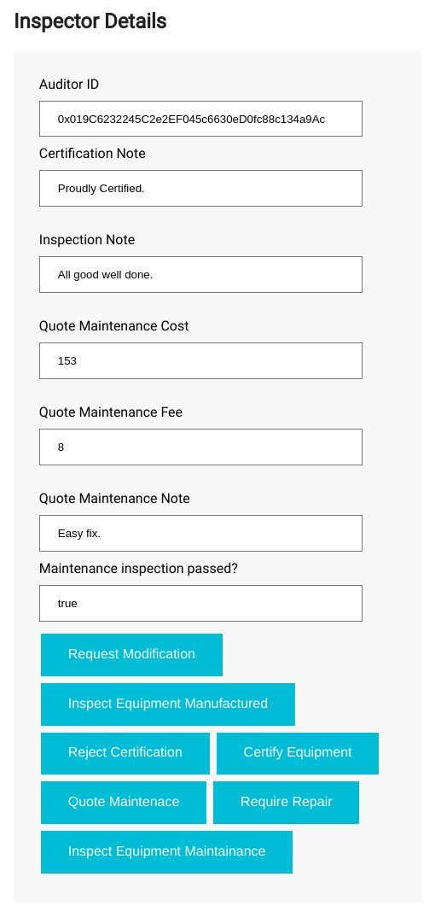

#### EndUSER Details
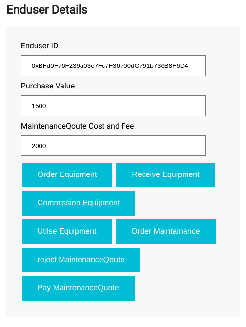

#### Maintainer Details
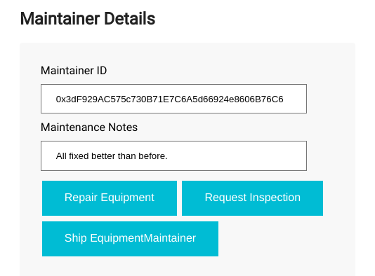